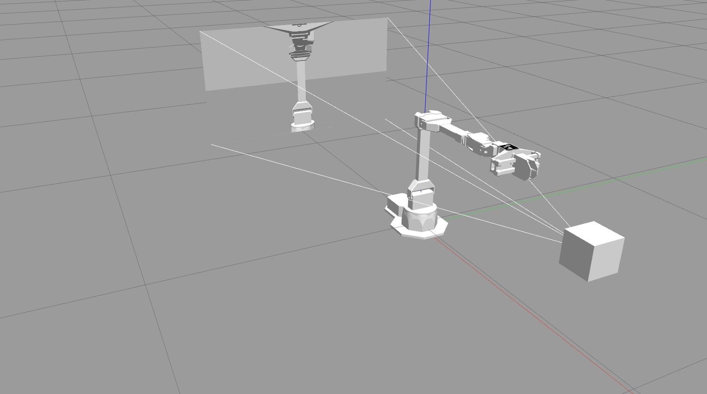
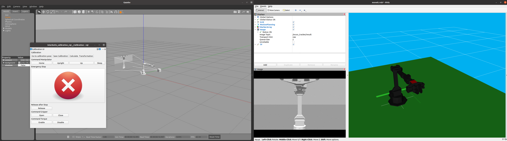
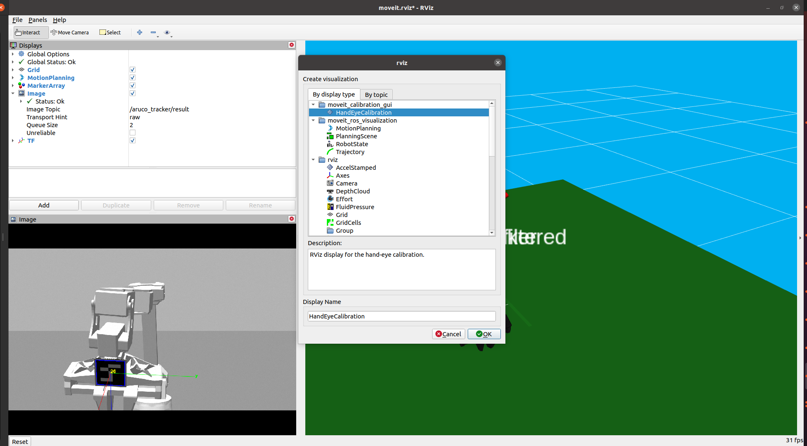
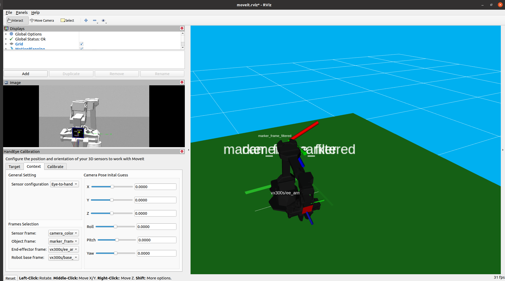
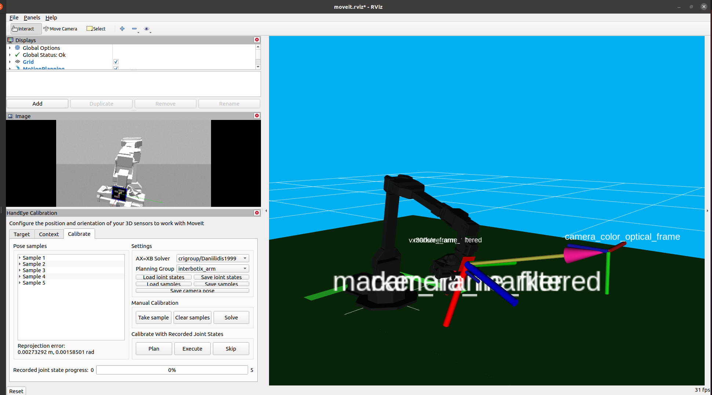

# interbotix_calibration
This repository contains two ROS1 packages for eye-to-hand calibration of an interbotix manipulator (e.g. vx300s or px150).
It requires an RGB camera and an Aruco marker.


## Installation instructions

**Requirements**  
[ROS1 (packages only tested with Noetic)](http://wiki.ros.org/noetic/Installation)  
[Installation of Interbotix packages](https://www.trossenrobotics.com/docs/interbotix_xsarms/ros_interface/index.html)  
[Installation of moveit_calibration](https://ros-planning.github.io/moveit_tutorials/doc/hand_eye_calibration/hand_eye_calibration_tutorial.html#getting-started)

**Python dependencies**  
numpy  
scipy

1. Go to the src folder of your catkin workspace ([or create a new one if needed](http://wiki.ros.org/catkin/Tutorials/create_a_workspace)).
2. Next, clone this repo:
```bash
git clone git@github.com:jelledouwe/interbotix_calibration.git
```
3. Install ROS dependencies:
```bash
cd ..
rosdep update
rosdep install --from-paths src --ignore-src -r -y
```
4. Make or build packages and source:
```bash
catkin_make
source devel/setup.bash
```
5. Verify installation:
```bash
roslaunch interbotix_calibration interbotix_calibration.launch robot_sim:=true camera_sim:=true
```
If all is well, you should see something like this:


## Calibration instructions

Here follows instructions for a calibration routine in the Gazebo simulator.
With the real robot it is very similar.

1. Launch the interbotix calibration launch file
```bash
roslaunch interbotix_calibration interbotix_calibration.launch robot_sim:=true camera_sim:=true
```
2. You might need to start the simulator by pressing the play button in the Gazebo GUI.
You also might need to turn of shadows by going to *Scene* and setting *shadows* to *True*.
3. Gazebo, Rviz and a GUI for commanding the robot should be started:

4. Press *Go to calibration pose* untill the marker is detected.
You can verify this in the Rviz Image window.
5. Next, click on *Add* in Rviz and select *HandEyeCalibration* from *moveit_calibration_gui* and click *Ok*:

6. Under the tab *Context* of  *HandEye Calibration* select the following frames:
  - Sensor_frame: camera_color_optical_frame
  - Object frame: marker_frame_filtered
  - End-effector frame: [robot_model]/ee_arm_link
  - Robot base frame: [robot_model]/base_link

7. In the calibrate tab, click on *Take sample*.
8. Move the robot to a new calibration pose by clicking on *Go to calibration pose* in the robot command GUI.
Do this until the robot is in a pose where the marker is detected.
9. Repeat steps 7 and 8 until you are satisfied with the calibration.
After 5 samples, the frame *marker_frame_filtered* and camera frame *camera_color_optical_frame* should be positioned correctly:

According to the *moveit_calibration* documentation, the calibration should converge after approximately 15 samples.
10. You can save the calibration result by clicking on *Save Calibration* in the robot command GUI.
The transformation between camera frame and robot base frame is saved, as well as the transformation between marker frame and end-effector frame in the *config* folder of the *interbotix_calibration* package.
The transformation between end-effector and marker is saved, because if the marker is a placed at a fixed position on the end-effector, we can reuse this transformation for later calibrations for which we then only need 1 (or a couple to improve accuracy) sample to perform the eye-to-hand calibration.

## Calibration on the real robot

**Supported Hardware**  
All Interbotix manipulators  
Realsense D435, L515  
Webcams supported by [usb_cam](http://wiki.ros.org/usb_cam)

**Prerequisites**  
First make sure that your camera is intrinsically calibrated by following e.g. this [tutorial](http://wiki.ros.org/camera_calibration/Tutorials/MonocularCalibration).


In the launch file interbotix_calibration.launch, select the correct arguments related to
- Your robot type, which are *robot_model*, *dof* and *joint_names*.  
- **If using a Realsense device** set *use_realsense* to true and set *camera_description* to realsense_d435.urdf.xacro or realsense_d435.urdf.xacro, for the D435 or L515, respectively.
- **If using a webcam** set *use_realsense* to false and set *video_device* and *camera_info_url* appropriately.
- Also, don't forget to set the arguments related to the Aruco marker that you are using, i.e. *marker_size* and *marker_id*.

Next, you can follow the instructions as stated above under *Calibration instructions*.
Note that you can move the robot upwards, to home, to upright, or to sleep (from home position only!) by clicking on *up*, *home* *upright*, *sleep*, in the robot command GUI, respectively.
Also note that a collision checker is active such that the robot doesn't move lower than its base.
You can press *emergency stop* in case of undesired movements and the robot will break.
By pressing *release* it will listen to commands again.
The gripper can be opened or closed using *Open* or *Close*.
The torques of the motor can be enabled and disabled using *Enable* or *Disable*, **BUT ONLY PRESS DISABLE WHEN YOU ARE HOLDING THE ROBOT OR WHEN YOU ARE IN SPACE, BECAUSE OTHERWISE IT WILL FALL DOWN DUE TO GRAVITY**.

## Reusing a previous calibration for single sample calibration

After performing a calibration and saving it as described under calibration instructions, you can perform eye-to-hand calibration with a single sample.
This is only possible if the marker is fixated on the end-effector and hasn't moved since the calibration was performed.
For this, select when launching *interbotix_calibration.launch* the argument *transform_filename* argument.
The calibration result should be save within the *config* folder of *interbotix_calibration*.
The *transform_filename* should be chosen as the name of this file.
Next, you perform the calibration by launching *interbotix_calibration.launch* and moving to a calibration pose.
You can now click *Calculate Transformation* and the transformation between camera frame and robot base frame appears in the terminal.
